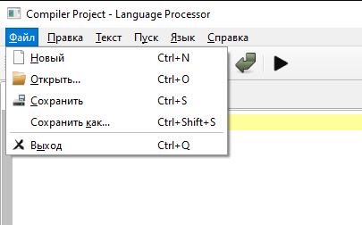
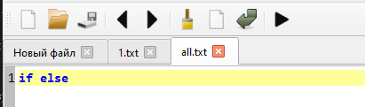
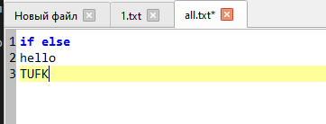
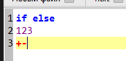
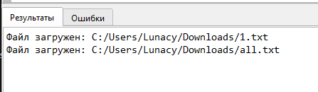

# Текстовый редактор для языка программирования (Курсовой проект / Лабораторная работа №1)

## Название и цель лабораторной работы
Разработка текстового редактора с графическим интерфейсом, предназначенного для написания исходного кода и дальнейшей интеграции с лексическим и синтаксическим анализатором (языковым процессором).

## Сведения об авторе
Гетман Денис Андреевич АВТ-314

## Описание проекта
Данное приложение представляет собой текстовый редактор, разработанный для курсового проекта по дисциплине "Теория формальных языков и компиляторов". Приложение обладает модульной структурой, позволяя в дальнейшем легко интегрировать компоненты компилятора. Анализатор вынесен в отдельный независимый модуль (analyzer.py) для упрощения масштабирования.

## Используемые технологии
* Язык программирования: Python 3
* Фреймворк для GUI: PyQt6
* Среда разработки: Любая IDE/редактор (VS Code, PyCharm и т.д.)

## Инструкция по сборке и запуску

### Предварительные требования
Убедитесь, что установлен Python 3.8 или новее.

### Точные шаги для установки зависимостей
Выполните команду в терминале:
```bash
pip install PyQt6 pyinstaller
```

### Запуск в режиме разработчика
```bash
python main.py
```

### Команды для сборки проекта в исполняемый файл (.exe)
Используйте терминал в папке проекта `d:/Прога/Py/TUFK`:
```bash
pyinstaller --noconsole --onefile --windowed --name="CompilerEditor" main.py
```

### Путь к готовому исполняемому файлу
После успешной сборки готовый файл будет находиться по пути:
`dist/CompilerEditor.exe` относительно корневой папки проекта.

## Описание интерфейса и функций (руководство пользователя)
* **Работа с файлами**: Поддерживается создание, открытие, сохранение файлов. Возможен Drag-and-Drop текстовых файлов прямо в окно программы. Присутствует защита от потери несохраненных данных при закрытии вкладок.

  

* **Многовкладочный интерфейс**: Можно работать с несколькими файлами одновременно.

  

* **Редактор кода**: Оснащен панелью нумерации строк и поддерживает масштабирование шрифта (Ctrl + колесико мыши).

  

* **Синтаксическая подсветка**: Автоматически выделяет ключевые слова (синий), операторы (красный), числа (фиолетовый) и комментарии (серый).

  

* **Нижняя панель (Output)**: Разделена на вкладки "Результаты" (для вывода логов компилятора) и "Ошибки" (для табличного представления ошибок с указанием строки и столбца).

  

* **Интернационализация**: Поддержка смены языка интерфейса (Русский/Английский) на лету через меню "Язык" (Language).

## Ограничения
* На текущем этапе кнопка "Пуск" (F5) возвращает заглушечные результаты из `analyzer.py`, так как сам анализатор (лексер/парсер) будет реализован в последующих работах.
* Подсветка синтаксиса в данный момент настроена на базовый набор ключевых слов и операторов.
