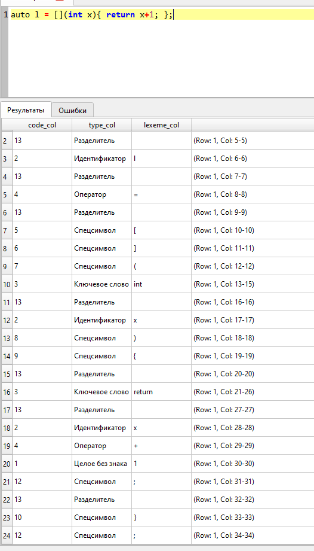
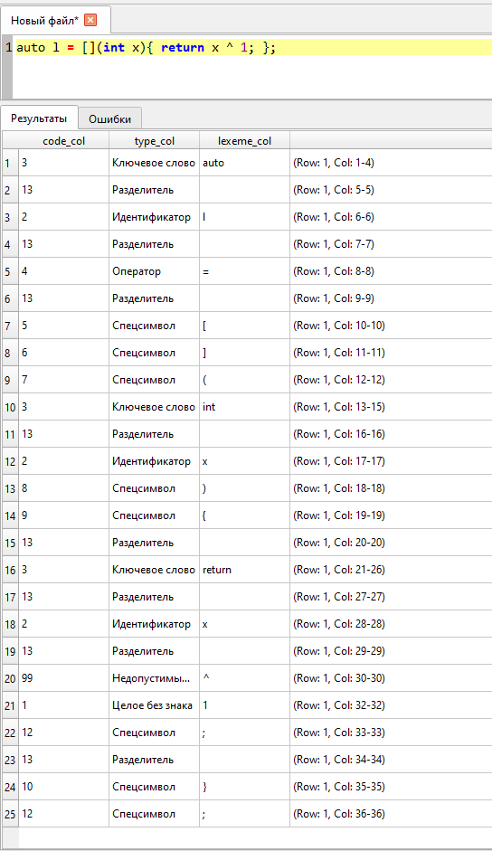
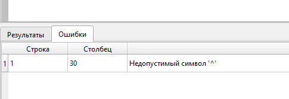
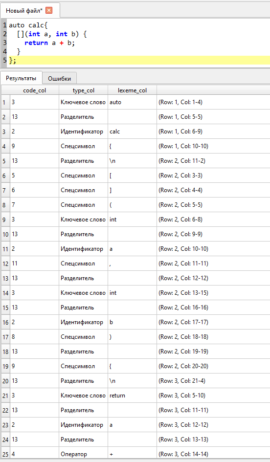
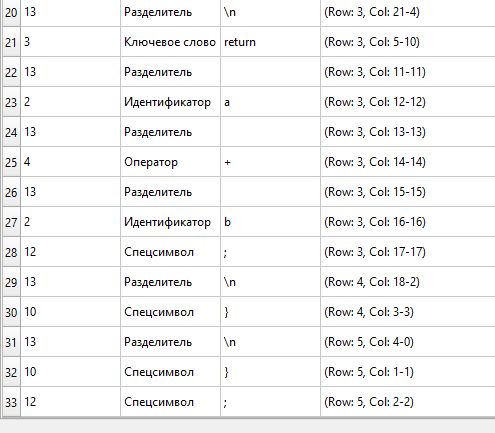
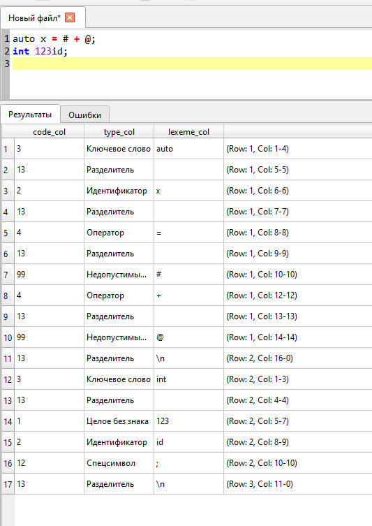
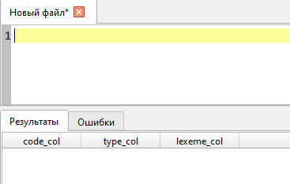

# Лабораторная работа 2. Разработка лексического анализатора (сканера)

## Автор
Гетман Денис Андреевич, АВТ-314

## Постановка задачи
Программная реализация сканера для выделения лексем из входного текста и интеграция в GUI языкового процессора.

## Вариант задания
**85.** Лямбда-выражения языка C++ (возвращающие арифметическое выражение).

### Примеры верных строк:
* `auto calc{ [](int a, int b, int c) { return a + (b * c); } };`
* `auto add = [](int x, int y) { return x + y; };`
* `auto get_value = []() { return 42 * 2 - 1; };`
* `auto complex_calc = [](double x) -> double { return (x + 10.5) / 2.0; };`
* `auto l = [](int m, int n){ return (m + n) % 2; };`

## Диаграмма состояний (Теоретическая модель FSM)


## Используемые технологии
* Язык программирования: Python 3
* Фреймворк для GUI: PyQt6

## Инструкция по сборке и запуску
### Точные шаги для установки зависимостей
Выполните команду в терминале:
```bash
pip install PyQt6 pyinstaller
```

### Команды для сборки проекта в исполняемый файл (.exe)
Используйте терминал в папке проекта `d:/Прога/Py/TUFK`:
```bash
pyinstaller --noconsole --onefile --windowed --name="CompilerEditor" main.py
```

### Путь к готовому исполняемому файлу
После успешной сборки готовый файл будет находиться по пути:
`dist/CompilerEditor_v2.exe` относительно корневой папки проекта.

## Описание интерфейса и функций (руководство пользователя)
* **Работа с файлами**: Поддерживается создание, открытие, сохранение файлов. Возможен Drag-and-Drop.
* **Таблица токенов**: По кнопке "Пуск" (F5) код разбивается на лексемы. Заполняется вкладка "Результаты" (Окно внизу).
* **Таблица ошибок**: Вторая нижняя вкладка служит для отображения некорректных лексем. 
* **Навигация по коду**: При клике на строку в любой из двух нижних таблиц (включая ошибки) исходный текст в верхнем окне подсвечивается в том месте, где находится лексема.

## Тестовые примеры

### 1. Корректная строка
**Код:** `auto l = [](int x){ return x+1; };`



### 2. Строка с недопустимым символом
**Код:** `auto l = [](int x){ return x ^ 1; };`  
*(Ошибка: недопустимый символ `^`)*



**Окно "Ошибки":**



### 3. Многострочный пример
**Код:**
```cpp
auto calc{ 
  [](int a, int b) { 
    return a + b; 
  } 
};
```





### 4. Ошибки в коде 
**Код:**
```cpp
auto x = # + @;
int 123id;
```



### 5. Пусто
**Код:**



## Ограничения
* Поддержано только выделение лексем. Синтаксический анализ в данной работе не производится.
